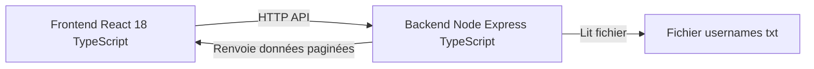

## User Directory - 10M Users Management System

Cette section décrit User Directory, une application web haute performance gérant jusqu'à 10 millions d'utilisateurs. Elle illustre la navigation efficace, la virtualisation avancée et la gestion de données massives côté serveur et client.

### Introduction

User Directory est une application web haute performance. Elle permet d'afficher et de naviguer efficacement à travers jusqu'à 10 millions d'utilisateurs sans impact sur les performances. Le système démontre l'optimisation algorithmique, la gestion efficace des données massives et les meilleures pratiques de développement full stack.

### Fonctionnalités Principales

Cette section récapitule les principales capacités fonctionnelles du système User Directory.

- Navigation alphabétique rapide avec menu latéral A-Z
- Liste virtualisée avec infinite scrolling, seulement 20 à 30 éléments DOM rendus
- Support de plus de 10 millions d'utilisateurs sans ralentissement
- Interface responsive et intuitive adaptée à plusieurs tailles d'écran
- Statistiques en temps réel par lettre de l'alphabet
- Système de cache intelligent pour maximiser les performances

### Architecture Technique

L'architecture sépare clairement le frontend réactif du backend Node pour optimiser la scalabilité. La virtualisation côté client réduit la charge DOM, tandis que l'indexation côté serveur accélère les recherches.

- Frontend : React 18, TypeScript, Vite
- Backend : Node.js, Express, TypeScript
- Virtualisation : react-window et react-window-infinite-loader
- Styling : CSS-in-JS via styles inline
- Outil de build : Vite

### Diagramme d'Architecture

Le diagramme suivant illustre les échanges entre frontend, backend et source de données textuelle.



### Prérequis

Les éléments suivants sont requis pour exécuter User Directory en environnement local.

- Node.js 18 ou version supérieure
- npm ou yarn installés globalement
- 1 Go de RAM minimum pour l'indexation backend

### Installation

Les étapes suivantes permettent d'installer le projet User Directory en local.

1. Cloner le repository.
   ```bash
   git clone https://github.com/votre-username/user-directory.git
   cd user-directory
   ```
2. Installer les dépendances backend.
   ```bash
   cd backend
   npm install
   ```
3. Installer les dépendances frontend.
   ```bash
   cd ../frontend
   npm install
   ```

### ⚙️ Configuration

Cette section décrit la configuration du backend et du frontend pour User Directory.

#### Configuration Backend (.env)

Le fichier `.env` du backend doit contenir les variables suivantes.

```env
PORT=3001
DATA_FILE_PATH=./data/usernames.txt
CACHE_TTL=3600
MAX_PAGE_SIZE=100
```

#### Configuration Frontend (vite.config.ts)

La configuration Vite du frontend doit proxy les requêtes API vers le backend.

```ts
export default defineConfig({
  server: {
    port: 5173,
    proxy: {
      '/api': 'http://localhost:3001'
    }
  }
})
```

### Structure du Projet

La structure ci-dessous présente l'organisation des dossiers pour le backend et le frontend.

```text
user-directory/
├── backend/
│   ├── data/
│   │   └── usernames.txt          # Fichier source 10M utilisateurs
│   ├── src/
│   │   ├── routes/
│   │   │   ├── users.ts    # Routes API    
│   │   ├── services/
│   │   │   └── UserFileService.ts     # Logique métier
│   │   ├── types/
│   │   │   └── index.ts           # Types TypeScript
│   │   └── index.ts               # Point d'entrée Express
│   ├── package.json
│   └── tsconfig.json
│
├── frontend/
│   ├── src/
│   │   ├── components/
│   │   │   ├── UserList.tsx       # Liste virtualisée
│   │   │   ├── AlphabetMenu.tsx   # Navigation A-Z
│   │   │   ├── LoadingSpinner.tsx
│   │   │   └── EmptyState.tsx
│   │   ├── hooks/
│   │   │   └── useUserData.ts     # Hook de données
│   │   ├── services/
│   │   │   └── api.ts    
│   │   ├── styles/
│   │   │   └── animations.css     # Animations CSS
│   │   ├── App.tsx                # Composant principal
│   │   └── main.tsx               # Point d'entrée React
│   │   └── index.html              
│   ├── package.json
│   └── tsconfig.json
│
└── README.md
```

### 🏃‍♂️ Démarrage

Cette section explique comment lancer le backend puis le frontend en développement.

1. Démarrer le backend.
   ```bash
   cd backend
   npm run dev
   ```
   Le serveur démarre sur `http://localhost:3001` et indexe automatiquement le fichier de données.
2. Démarrer le frontend.
   ```bash
   cd frontend
   npm run dev
   ```
   L'application est accessible sur `http://localhost:5173`.

---