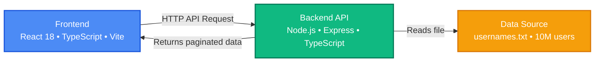

## User Directory - 10M Users Management System

This section describes User Directory, a high-performance web application managing up to 10 million users. It demonstrates efficient navigation, advanced virtualization, and massive data management on both the server and client sides.

### Introduction

User Directory is a high-performance web application. It allows for effective display and navigation through up to 10 million users without performance impact. The system demonstrates algorithmic optimization, efficient management of massive data, and full-stack development best practices.

### Key Features

This section summarizes the main functional capabilities of the User Directory system.

- Fast alphabetical navigation with an A-Z side menu
- Virtualized list with infinite scrolling, only 20 to 30 DOM elements rendered
- Support for over 10 million users without slowdown
- Responsive and intuitive interface adapted to various screen sizes
- Real-time statistics per letter of the alphabet
- Intelligent caching system to maximize performance

### Technical Architecture

The architecture clearly separates the reactive frontend from the Node backend to optimize scalability. Client-side virtualization reduces DOM load, while server-side indexing speeds up searches.

- Frontend: React 18, TypeScript, Vite
- Backend: Node.js, Express, TypeScript
- Virtualization: react-window and react-window-infinite-loader
- Styling: CSS-in-JS via inline styles
- Build Tool: Vite

### Architecture Diagram

The following diagram illustrates the exchanges between the frontend, backend, and text data source..



### Prerequisites

The following are required to run User Directory in a local environment.

- Node.js 18 or higher
- npm or yarn installed globally
- Minimum 1 GB of RAM for backend indexing

### Installation

The following steps allow you to install the User Directory project locally.

1. Clone the repository.
   ```bash
   git clone https://github.com/YassmineEm/User-Management.git
   cd User-Management
   ```
2. Install backend dependencies.
   ```bash
   cd backend
   npm install
   ```
3. Install frontend dependencies.
   ```bash
   cd ../frontend
   npm install
   ```

### ⚙️ Configuration

This section describes the configuration of the backend and frontend for User Directory.

#### Backend Configuration (.env)

The backend `.env` file must contain the following variables.

```env
PORT=3001
DATA_FILE_PATH=./data/usernames.txt
CACHE_TTL=3600
MAX_PAGE_SIZE=100
```

#### Frontend Configuration (vite.config.ts)

The frontend Vite configuration must proxy API requests to the backend.

```ts
export default defineConfig({
  server: {
    port: 5173,
    proxy: {
      '/api': 'http://localhost:3001'
    }
  }
})
```

### Project Structure

The structure below presents the folder organization for the backend and frontend.

```text
user-directory/
├── backend/
│   ├── data/
│   │   └── usernames.txt          # 10M users source file
│   ├── src/
│   │   ├── routes/
│   │   │   ├── users.ts    # API Routes    
│   │   ├── services/
│   │   │   └── UserFileService.ts     # Business logic
│   │   ├── types/
│   │   │   └── index.ts           # TypeScript types
│   │   └── index.ts               # Express entry point
│   ├── package.json
│   └── tsconfig.json
│
├── frontend/
│   ├── src/
│   │   ├── components/
│   │   │   ├── UserList.tsx       # Virtualized list
│   │   │   ├── AlphabetMenu.tsx   # A-Z Navigation
│   │   │   ├── LoadingSpinner.tsx
│   │   │   └── EmptyState.tsx
│   │   ├── hooks/
│   │   │   └── useUserData.ts     # Data hook
│   │   ├── services/
│   │   │   └── api.ts    
│   │   ├── styles/
│   │   │   └── animations.css     # CSS Animations
│   │   ├── App.tsx                # Main component
│   │   └── main.tsx               # React entry point
│   │   └── index.html              
│   ├── package.json
│   └── tsconfig.json
│
└── README.md
```

### Getting Started

This section explains how to start the backend and then the frontend for development.

1. Start the backend.
   ```bash
   cd backend
   npm run dev
   ```
   The server starts on `http://localhost:3001` and automatically indexes the data file.
2. Start the frontend.
   ```bash
   cd frontend
   npm run dev
   ```
   The application is accessible at `http://localhost:5173`.

---